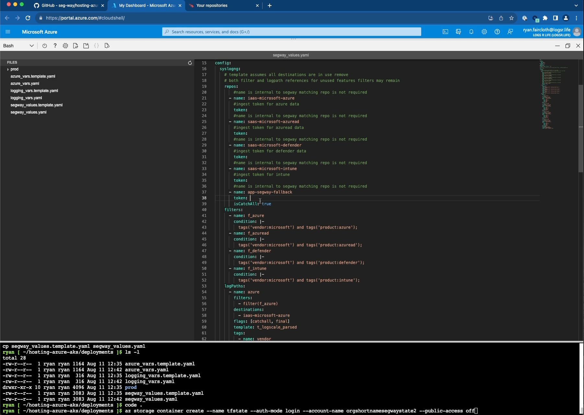

# hosting-azure-aks

This project deploys a seg-way collection platform in Azure using AKS for use with CrowdStrike/Logscale
to collect data from Azure, AzureAD(Entra), Intune and Defender products.

## Install walk through (click)

[](https://app.screencast.com/SupiEWJghimRX/e "Segway Install Walkthrough")

## Required Access

* The user executing this setup process will require the rights to create a security group in Azure Active Directory
* The rights to create resources including resource groups in Azure
* The ability to connect to the required azure endpoints
* The ability to use git and access github.com
* The ability to access registry.terraform.io

## Setup Deployment Environment

* Launch [](https://shell.azure.com/bash)

## Register Required Providers

Restricted accounts may disable required providers by default use the following commands to enable required providers

```bash
az provider register --namespace 'Microsoft.ContainerService' --wait
az provider register --namespace 'Microsoft.ContainerInstance' --wait
az provider register --namespace 'Microsoft.Eventhub' --wait
az provider register --namespace 'Microsoft.Insights' --wait
```

## Create the resource group

### using cli

While an existing resource group can be used a shared group may be confusing to future administrator

```bash
# replace "segway-state" with a meaningful name conforming to org standards
# --tags should be modified to conform to org standards or removed
AZRG=<name of group>
# Such as EastUS
AZLOCATION=<Azure Location> 
az group create --name $AZRG --location $AZLOCATION
```

### Existing or created by another process

Using an exisitng group simply set the variable for later use

```bash
AZRG=<name of group>
```

## Create a storage account for tf state

The storage account and container created below will be accessible via internet endpoints. Use a approved configuration appropriate for your environment as needed.

1 Create a storage account note the name of this account must be unique among *ALL* Azure customers. The name selected must conform to Azure requirements. Most commonly all lower case and numeric with no spaces dashes or symbols.

```bash
AZSTATE=shortuniquename
az storage account create --name $AZSTATE --resource-group $AZRG
```

2 Create a container in the storage account named "tfstate"

```bash
az storage container create --name tfstate --auth-mode login --account-name $AZSTATE --public-access off
```

## Create a cloud drive to persist working configuration across deployments

The same command can be reused to remount in the future

```bash
clouddrive mount -s <subscriptionid> -g $AZRG -n $AZSTATE -f segateway -d 100
```

## Install Terragrunt

The default AzureShell contains all required tools except terragrunt install one time using the following procedure

* Install terragrunt

    ```bash
    mkdir ~/bin || true;curl -L -o ~/bin/terragrunt https://github.com/gruntwork-io/terragrunt/releases/download/v0.48.7/terragrunt_linux_amd64; chmod +x ~/bin/terragrunt
    ```

## Clone Source

* Clone the repository

    ```bash
    git clone https://github.com/seg-way/hosting-azure-aks.git clouddrive/host-azure-aks
    ```

## Configure

* `cd` to the directory

    ```bash
    cd clouddrive/host-azure-aks/deployments
    ```

* Rename `deployments/*.template.yaml` to remove `.template`

    ```bash
    cp azure_vars.template.yaml azure_vars.yaml
    cp logging_vars.template.yaml logging_vars.yaml
    cp segway_values.template.yaml segway_values.yaml
    ```

* Launch editor for example VSCode `code .`
* Update value files per comments in template and save changes
* If conditional access is in use aquire needed roles
* If using a environment other than Azure Cloud Shell From a command prompt authenticate to azure `az login`
* Deploy

    ```bash
    terragrunt run-all apply --terragrunt-non-interactive
    ```

## Post deployment

* Configure diagnostic settings for azure resources to use the created azure eventhub
* Configure activity logging settings for AzureAD to use the created azuread eventhub
* Configure defender and intune to the respective defender and intune hubs

[](https://app.screencast.com/kNzItkQAhNDVp/e "Microsoft Cloud Logging Configuration Walkthrough")

## Upgrades

* Launch [](https://shell.azure.com/bash)
* `cd` to the directory

    ```bash
    cd hosting-azure-aks
    ```

* Update the repo

    ```bash
    git pull
    ```

* `cd` to the directory

    ```bash
    cd deployment
    ```

* Compare the template files in deployments to the configured versions used previously add/remove values accordingly

* Deploy

    ```bash
    terragrunt run-all apply --terragrunt-non-interactive
    ```
